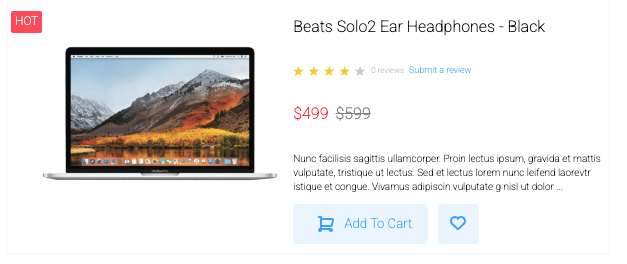

## Storybook Library
This storybook library was created via storybook in conjucation with the javascript framework React. CSS was done without any libraries such as bootstrap. All components used within larger components were built out in the beginning and are highly adaptable to fit customer needs.

## Deployed URL
https://cpassafaro.github.io/Component-Library/storybook-build/?path=/story/button--primary

## Sample
***

## Mockup Used

Components were designed in the mock-up from Adobe xd called bouncer.xd. Components include: Variations of different styles of buttons, Input fields, Selector fields, clicked/checkboxes, products displays.

## How to use these components
Fork and clone repo, then run npm install to install project dependencies.

Variations of components are able to be utilized based on which props are passed to the storybook components. 

Components are saved in the src/components folder. The button folder contains all the different variations of buttons that are created. 

Forms folder contains the input fields, selector dropdown menu, voucher input field, and checkbox fields. Their are multiple js files for this folder that contribute to the storybook input fields.

Product section contains different variations of product displays for the macbook and beats headphones. These product displays contain interactive components that react on mouseover. Some incorporate button components created in the button folder. 

Images used in this project are from the adobe mockup and are saved in a folder in the repo to access.